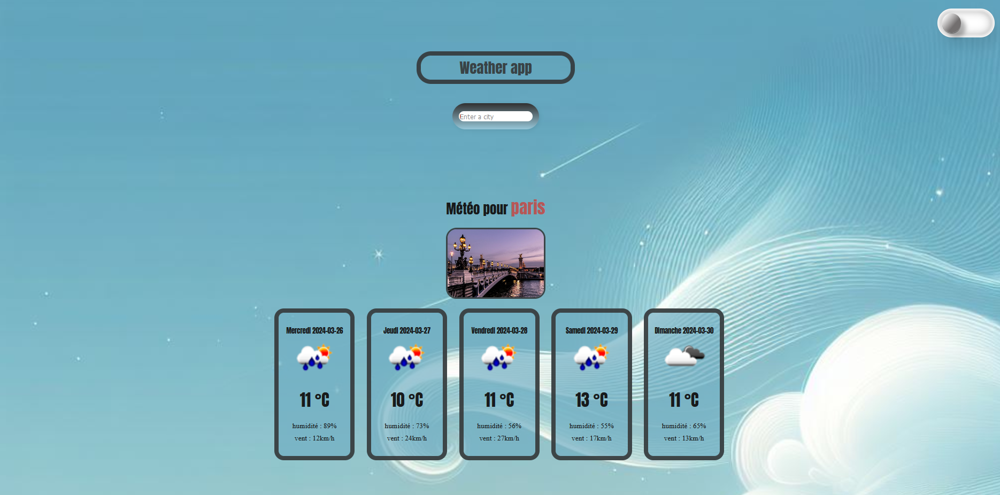
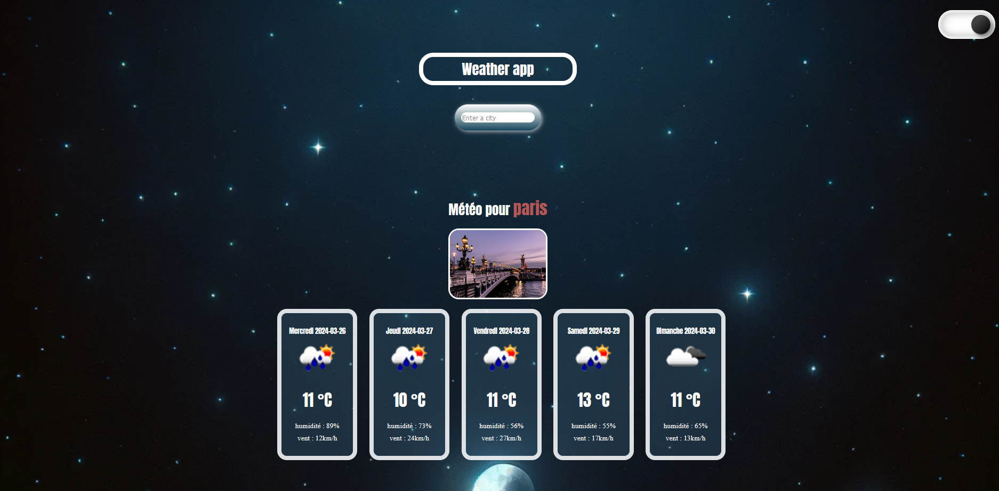

# app-weather

Ce projet présente une application météo qui permet à l'utilisateur de rechercher une ville pour obtenir des informations sur la météo en temps réel ainsi que des prévisions pour les cinq jours à venir.

### Sommaire

1. [Description du Projet](#description)
2. [Captures d'écran](#captures-décran)
3. [Installation et Utilisation](#installation)
4. [Ressources Utilisées](#langages)

## 📌 détails du projet

### description

Mon projet permet de saisir le nom d'une ville et de recevoir des informations telles que la température, l'humidité et la vitesse du vent pour les cinq prochains jours. En ajoutant une autre ville, il devient possible de comparer les données. De plus, l'application inclut un graphique qui affiche les températures des villes sélectionnées pour une visualisation plus claire.

https://dams4953.github.io/app-weather/

### Captures d'écran

## 📌 installation et utilisation

### Installation
1. Clonez le repot.
2. Accédez au répertoire du projet.
3. Assurez-vous d'avoir Node.js et npm installés sur votre machine.
4. Assurez-vous également d'avoir Vite installé. (npm install vite --save-dev)
5. Assurez-vous également d'avoir Sass installé. (npm install sass --save-dev)
6. Pour démarrer le serveur, utilisez 'npm run dev'.
7. L'application sera disponible au localhost indiqué.

### Utilisation
- Saisissez le nom d'une ville dans le champ de recherche et appuyez sur "Enter".
- Vous verrez alors les informations météorologiques actuelles ainsi que les prévisions pour les cinq prochains jours.
- Les informations pour chaque ville ajoutée seront affichées sous forme de cartes.
- Vous pouvez comparer les températures des différentes villes à l'aide du graphique.
    
## 📌 ressources utilisées

### langages

### api

- OpenWeatherMap pour les données météorologiques.
- Unsplash pour les images de fond en fonction de la ville.

### bibliothèques

- ChartJS pour le graphique.
